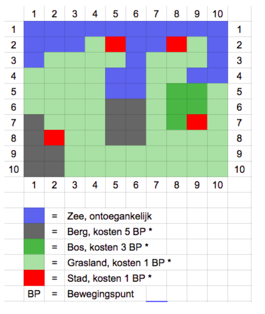

Handelaar
=========


Inleiding
=========

Jouw opdrachtgever is een gerenommeerd en bewezen handelaar. Zij heeft gehoord dat zij nog meer winst kan maken door slim gebruik te maken van informatietechnologie. Hiertoe heeft zij jullie team uitgenodigd om haar nieuwe handelssysteem te implementeren.

De handelaar opereert in een vast aantal steden. Dit wordt de wereld genoemd. In iedere stad kunnen goederen ingekocht en verkocht worden. Aangekomen in een volgende stad gebeurt hetzelfde, waarbij de handelaar uiteraard zal proberen winst te maken op de transacties.

De basisgegevens waarmee gewerkt kan worden zijn de volgende:

* terreinkaart van de wereld
* lijst van steden
* lijst van prijzen van goederen, zowel inkoop als verkoop

Het systeem zal in staat moeten zijn om alle gegevens van de wereld in te lezen. 
Daarnaast moet het systeem de handelaar kunnen helpen met het maken van zijn beslissingen.

Deze beslissingen zijn niet altijd even eenvoudig te maken, en er zal dus soms een keuze moeten worden gemaakt tussen een snelle en een grondige oplossing. Het liefst willen we natuurlijk een slimme oplossing: een die redelijk snel en redelijk grondig is. Gelukkig hoef je hiervoor niet altijd zelf het wiel opnieuw voor uit te vinden en kun je vaak gebruik maken van reeds bestaande algoritmes.


Voorbeeld terreinkaart
----------------------



Deze terreinkaart is 10 bij 10. In het gebied komen bergen, bossen, grasland, zee en steden voor. Elk gebied kent zijn eigen kosten om erdoor te bewegen, afhankelijk hoe mensvriendelijk het terrein is.


Voorbeeld stedenlijst
---------------------

In de terreinkaart uit het vorige voorbeeld staan vier steden. De stedenlijst voor deze wereld is (x/y coördinaat, naam stad):

* 5/2 Aberdeen
* 8/2 Birmingham
* 9/7 Cambridge
* 2/8 Derry


Voorbeeld markt
---------------

De steden uit het vorige voorbeeld hebben de volgende goederen aangeboden of gevraagd op de markt:
* Aberdeen BIEDT schapen voor $15
* Birmingham VRAAGT schapen voor $30
* Cambridge BIEDT schapen voor $20
* Cambridge BIEDT stenen voor $10
* Derry VRAAGT stenen voor $12


Opdracht 1 - inlezen van de gebiedsgegevens
===========================================

Het systeem moet in staat zijn om een handelswereld in te lezen. 
Zie de folder `src/test/resources/kaarten` in de student kit voor voorbeelden van het in te lezen formaat.

Eisen aan de opdracht:

* de kaart van de wereld heeft *dynamische afmetingen* die bepaald worden door de aangeleverde kaart
* zowel de `Kaart` als de `Markt` moeten dezelfde `Stad` instanties gebruiken. Dat wil zeggen dat bij het inlezen van de gegevens een Stad slechts *één keer geïnstantieerd* wordt.
* alle steden die in de marktlijst worden genoemd moeten *gedefiniëerd zijn* in de stedenlijst. Het systeem geeft een foutmelding als dit niet zo is.
* de testen in de bijgeleverde test (`WereldLaderImplTest`) moeten slagen.


Opdracht 2 - snelste pad tussen twee steden
===========================================

De handelaar wil dat het systeem het snelste (dus niet noodzakelijkerwijs het kortste!) pad kan bepalen tussen twee steden. Hiertoe moet rekening gehouden worden met de terreinkosten en terrein waar niet doorheen bewogen kan worden. 

De volgende methode van Handelaar moet worden geïmplementeerd:

```
    SnelstePadAlgoritme nieuwSnelstePadAlgoritme();
```

SnelstePadAlgoritme is een interface waarvan een implementerende klasse gemaakt moet worden (`SnelstePadAlgoritmeImpl`).
Deze implementerende klasse moet de methoden uit de interface bevatten. In dit geval is het er maar één, de `bereken` methode.
Deze `bereken` methode geeft een `Pad` terug. Dit is weer een interface waarvan weer een implementatie klasse gemaakt moet worden (`PadImpl`).
Voor de functionaliteit die Pad moet aanbieden kan je in de JavaDoc van de Pad interface kijken.

Een mogelijk algoritme wat gebruikt kan worden voor het bepalen van het kortste pad is het [Ant Race algoritme](http://blaeul.de/s.php?l=de&d=antraces).
Een ander algoritme is [A*](http://www.policyalmanac.org/games/aStarTutorial.htm).

Eisen aan de opdracht:
* Het resulterende Pad moet een begaanbare route bevatten van de start naar eind coordinaten.
* Er moet een begaanbaar pad berekend kunnen worden voor alle steden combinaties.
* Het pad moet het snelste pad zijn (niet het kortste!).
* Het pad moet kwaliteitief goed zijn.
* Het pad moet efficiënt berekend worden.

Tip:
* Schrijf unit testen om je code (en de acceptatie criteria) te controleren.


Opdracht 3 - zo snel mogelijk alle steden aandoen
=================================================

De handelaar wil, vanuit Public Relations oogpunt, graag een keer alle steden langs om met belangrijke functionarissen te praten en het volk gerust te stellen dat er niks onwelvallends gebeurt. Uiteraard mag dat allemaal niet teveel tijd kosten; tijd is immers geld. De vraag aan jullie is om een route te plotten waarmee alle steden precies één keer wordt aangedaan in een zo kort mogelijk tijd. 

De volgende methode van Handelaar moet worden geïmplementeerd:

```
StedenTourAlgoritme nieuwStedenTourAlgoritme();
```

De oplossing bestaat uit de lijst van steden. De eerste stad in de lijst is de stad waar gestart wordt. De laatste stad in de lijst is de stad waar geëindigd wordt. De gehele lijst vormt op volgorde de route waarmee de handelaar de steden zal moeten aandoen.

Een voorbeeld algoritme waarmee dit probleem kan worden opgelost is die voor het [travelling salesman probleem](https://en.wikipedia.org/wiki/Travelling_salesman_problem).

Eisen aan de opdracht:
* het algoritme *moet* gebruik maken van het kortste pad algoritme van de voorgaande opdracht
* iedere stad wordt precies maar één keer aangedaan
* de startstad bepaal je zelf; uiteraard naar aanleiding van wat het meest efficiënt is
* De route moet kwaliteitief goed zijn.
* De route moet efficiënt berekend worden.

Opdracht 4 - zoveel mogelijk winst in zo min mogelijk tijd
==========================================================

De bekroning van het systeem. De handelaar wil dat het systeem berekent hoe de winst geoptimaliseerd kan worden voor een wereld. Hiertoe moet beslislogica geschreven worden die aan het simulatiesysteem een plan aanlevert voor uitvoering van de bewegingen en de in- en verkooporders. Na een vast aantal ronden wordt dan gekeken hoeveel winst is gerealiseerd. Voor dit algoritme wil de handelaar zelf de startstad bepalen. Belangrijk is dat rekening gehouden wordt met een beperkt startkapitaal en een beperkte transportcapaciteit.

De volgende methode van Handelaar moet worden geïmplementeerd:

```
HandelsplanAlgoritme nieuwHandelsplanAlgoritme();
```

Het handelsplan bestaat uit een lijst van HandelsActies. Iedere HandelsActie kan één van de volgende acties bevatten:
* beweeg naar stad (kost tijd)
* koop goed in (kost geld, kost capaciteit)
* verkoop goed (levert geld op, maakt capaciteit vrij)

De simulatie zal alle acties in volgorde uitvoeren. Als een actie is ingebracht die niet uitvoerbaar is, dan zal het systeem eindigen met een foutmelding.

Eisen aan de opdracht:
* het algoritme moet gebruik maken van het eigen kortste pad algoritme van een eerdere opdracht.
* Het handelsplan moet kwaliteitief goed zijn (dwz winst maken en liefst veel!).
* Het handelsplan moet efficiënt berekend worden.

Een manier om het probleem op te lossen is met een (beslissingsboom)[https://en.wikipedia.org/wiki/Decision_tree_model].

